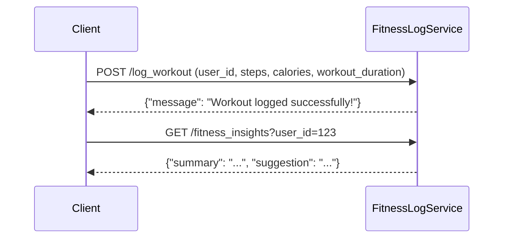

#### Communication Contract
##### Overview

##### This microservice allows users to log their workout data and retrieve fitness insights based on a specified date range. It provides two main endpoints:

- POST /log_workout - Logs a workout session.
- GET /fitness_insights - Fetches summarized workout insights for a given user.

##### How to Request Data from the Microservice:
1. Log a Workout (POST /log_workout)

This endpoint records a user's workout session, including steps, calories burned, and optional workout duration.

##### Required Parameters:
1. user_id(string): Unique ID of the user
2. steps(int): Number of steps taken
3. calories(int): Calories burned during workout
4. workout_duration(int): Optional, but this is the workout duration in minutes

#### NOTE:
Do not use the example code I provided as your test program, all test code must be written on your own.

##### Example Request:

```python
import requests

url = "http://localhost:5000/log_workout"
data = {
    "user_id": "12345",
    "steps": 8000,
    "calories": 300,
    "workout_duration": 45
}

response = requests.post(url, json=data)
print(response.json())  # Expected: {"message": "Workout logged successfully!"}
```

##### Example Response:

```python
{
    "message": "Workout logged successfully!"
}
```

##### How to Receive Data from the Microservice:
1. Get Fitness Insights (GET /fitness_insights)
This endpoint retrieves fitness insights based on a specified date range. If no dates are provided, it defaults to the last 7 days.

##### Required Parameters:
1. user_id(string): Unique ID of the user
2. start_date(string): Optional,  but this is the start date (YYYY-MM-DD). Defaults to 7 days ago.
3. end_date(string): Optional, but this is the end date (YYYY-MM-DD). Defaults to today.

##### Example Request:

```python
import requests

url = "http://localhost:5000/fitness_insights"
params = {
    "user_id": "12345",
    "start_date": "2025-02-01",  # Optional (YYYY-MM-DD)
    "end_date": "2025-02-15"     # Optional (YYYY-MM-DD)
}

response = requests.get(url, params=params)
print(response.json())
```

##### Example Response:

```python
{
    "summary": "You walked 55,000 steps and burned 3,200 calories in this period.",
    "suggestion": "Increase cardio by 10 minutes per day."
}
```

##### Running the Microservice:
1. Install Dependencies:
```bash
pip install flask requests
```
2. Run the Service on one terminal:
```bash
python microservice1.py
```
3. Test the Endpoints on another terminal:
```bash
python test_microservice.py
```

### UML Sequence Diagram:


